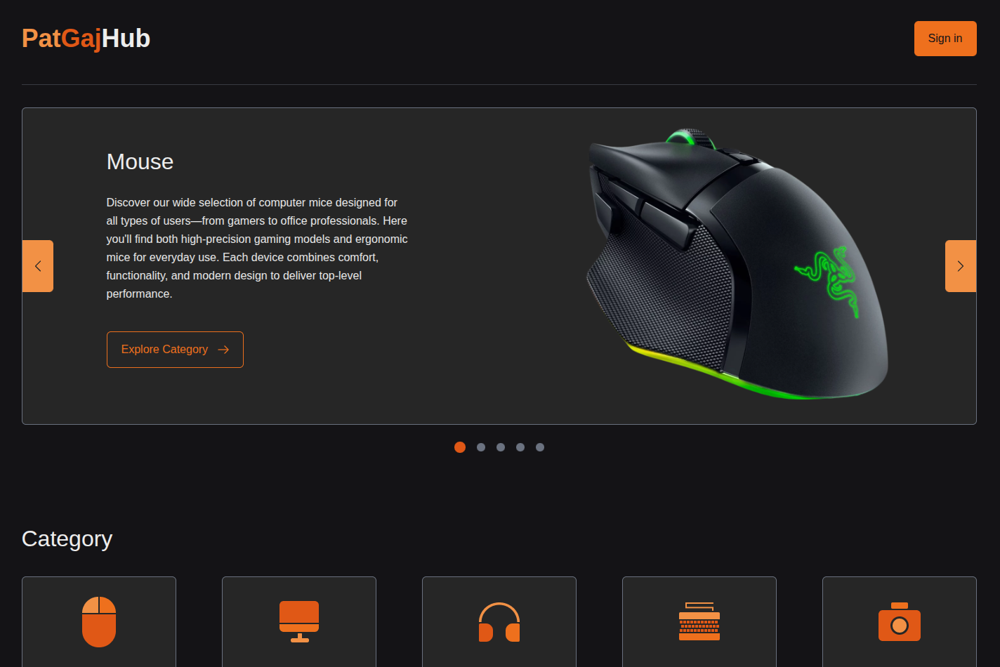
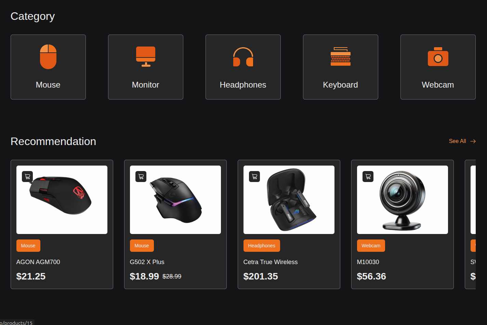
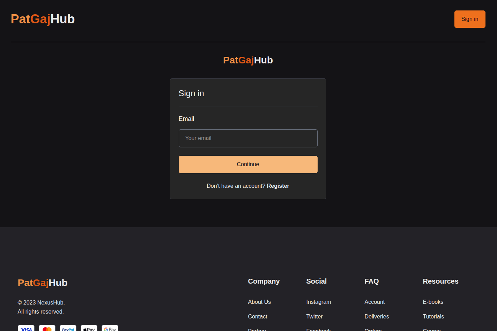
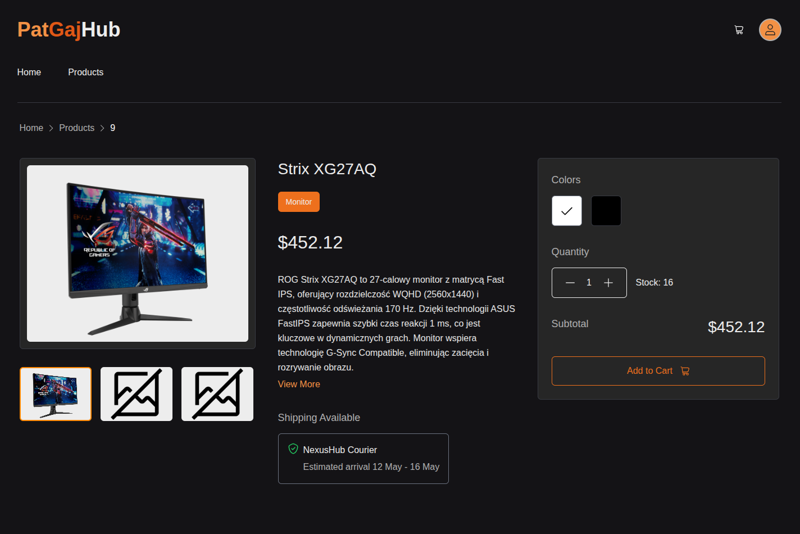
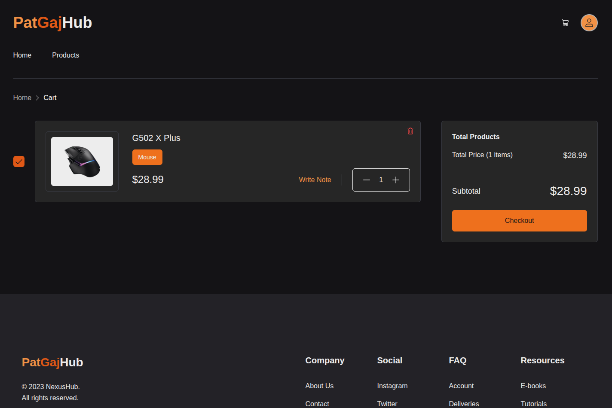
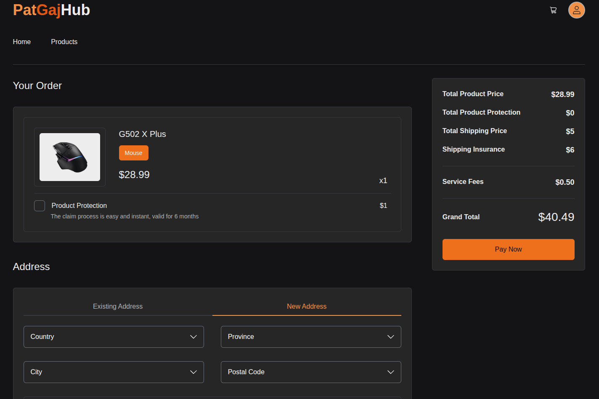
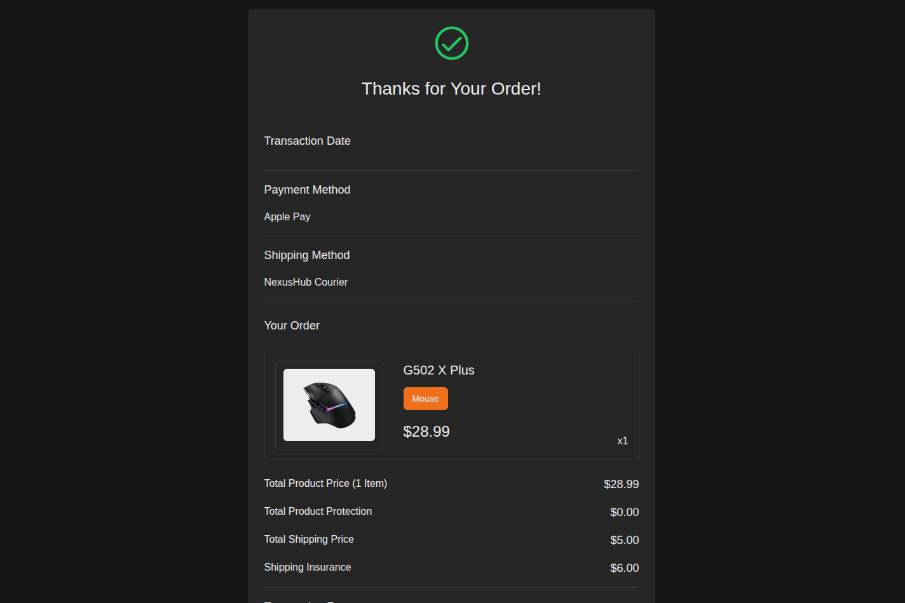

# Symulacja Sklepu Internetowego

Projekt symulacji sklepu internetowego stworzony w oparciu o **Next.js**, zgodnie z dostarczonym projektem graficznym w **Figmie** oraz szczegółowymi wymaganiami technicznymi. Aplikacja ma na celu zaprezentowanie umiejętności tworzenia nowoczesnej aplikacji fullstack.

# Uruchomienie

## .env potrzebne do uruchomienia projektu

- **DATABASE_URL** – Pełny URL do bazy danych, który zawiera wszystkie szczegóły niezbędne do nawiązania połączenia z bazą danych.
- **DIRECT_URL** – URL do bezpośredniego połączenia, często wykorzystywany w celu szybszego dostępu do bazy bez pośredników.
- **NEXTAUTH_SECRET** – Sekretny klucz wykorzystywany do podpisywania tokenów i zapewnienia bezpieczeństwa sesji użytkowników w NextAuth.js.
- **NEXTAUTH_URL** – URL aplikacji, który wskazuje adres, pod którym działa aplikacja NextAuth.js.
- **DATABASE_USER** – Użytkownik bazy danych, który ma odpowiednie uprawnienia do łączenia się z bazą danych.
- **DATABASE_PASSWORD** – Hasło użytkownika bazy danych.
- **DATABASE_NAME** – Nazwa bazy danych.

## Uruchomienie krok po kroku

- **npm install** – Instalacja zależności
- **npm run db:up** – Uruchomienie bazy danych
- **npm run postinstall** – Wygenerowanie modeli Prisma
- **npx prisma migrate dev** --name init(zamiast init wpisać nazwę nowej migracji) – Stworzenie migracji
- **npx prisma db seed** – Załadowania początkowych danych do bazy
- **npm run dev** – Uruchomienie aplikacji w trybie deweloperskim

- **npm run start:all** - Uruchomienie bazy danych i aplikację w trybie deweloperskim.(po początkowej )

## Cel projektu

Celem projektu jest stworzenie symulacji aplikacji e-commerce z następującymi kluczowymi funkcjonalnościami:

- System logowania i rejestracji użytkownika
- Strona główna
- Lista produktów
- Strona szczegółów produktu
- Koszyk zakupowy
- Proces finalizacji zamówienia
- Panel użytkownika / profil

## Zastosowane technologie

Projekt został zbudowany z wykorzystaniem następujących technologii:

- **Next.js** – framework Reacta z obsługą SSR oraz API Routes
- **React** – do budowy komponentowego interfejsu użytkownika
- **TypeScript** – statyczne typowanie kodu dla większego bezpieczeństwa
- **Tailwind CSS** – framework CSS oparty na klasach narzędziowych
- **Prisma ORM** – bezpieczny typowo ORM do komunikacji z bazą danych
- **PostgreSQL** – relacyjna baza danych
- **Docker** – środowisko deweloperskie w kontenerach

## Wdrożenie

Aplikacja zostanie wdrożona na platformie **Vercel**, z pełną integracją backendu i bazy danych.

# Galeria

